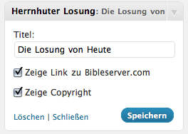
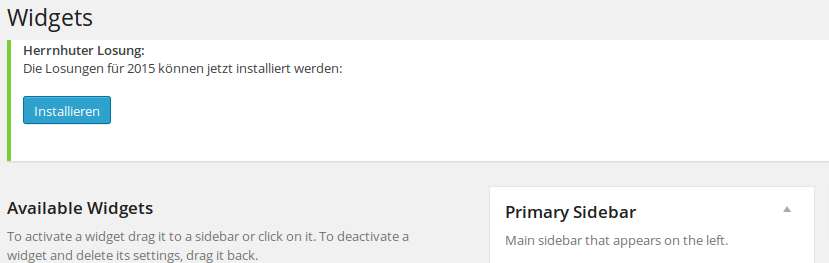

Herrnhuter Losung
=================

Aktuelle Version: 1.7.5 (vom 29.12.2018)

*Donate link*: http://www.lutherkirchgemeinde-radebeul.de/ 
*Tags*: deutsch, german, bible, Bibel, daily, täglich 
*Requires at least*: 2.8 
*Tested up to*: 5.0.2 
*License*: GPLv2 or later 
*License URI*: http://www.gnu.org/licenses/gpl-2.0.html 

Das Plugin zeigt die Losung des Tages der Herrnhuter Brüdergemeine in einer Seitenliste oder im Fußbereich an.

Description
-----------

Das Plugin zeigt die Losung der Tages der Herrnhuter Brüdergemeine in Deutsch als Widget in einer Seitenleiste oder im Fußbereich an. - Die Anzeige der Losungstexte besteht immer aus beiden Bibelversen, dem alttestamentlichen Text
(der Losungsvers) und dem neutestamentlichen Vers (dem Lehrtext).

Aus lizenzrechtlichen Gründen fehlt der Liedvers bzw. das Gebet.

*Die Losungen gibt es seit 1728. Für jeden Tag zieht die Herrnhuter Brüdergemeine einen Vers aus dem alten Testament der Bibel, dazu wird eine Vers aus dem neuen Testament und ein sowie ein Liedvers oder ein Gebet auswählt. Die Losungen verbinden Menschen aus verschiedenen Konfessionen und mit unterschiedlicher Frömmigkeit.*

*Weiter Informationen gibt es unter: [losungen.de](http://www.losungen.de/ "Offizelle Webseiter der Herrnhuter Losungen")*

### Auszug der Lizenzbedingungen der Herrnhuter Brüdergemeine für die Nutzng der Losungen

*Diese Bedingungen gelten für die beigelegte XML-Datei, die die Losungen enthält. Das Wordpress-Plugin ist unabhängig davon unter "GPLv2 or later" lizenziert.*

- Inhaberin Urheberrechts *(der Losungen)* ist die Evangelische Brüder-Unität – Herrnhuter Brüdergemeine.
Die Bibeltexte aus der Lutherbibel, revidiert 2017, und aus der Lutherbibel, revidierte Texte 1984, durchgesehene
Ausgabe in neuer Rechtschreibung, unterliegt dem Copyright der Deutschen Bibelgesellschaft, Stuttgart.

- Auf Internet-Seiten, die auch kommerziellen Zwecken dienen, sowie in Software, die entgeltlich angeboten wird, dürfen die Losungen nicht verwendet werden. Gleiches gilt für Internetseiten und Softwareprogramme deren Inhalt geeignet ist, das Ansehen der Evangelischen Kirche und der Evangelischen Brüder-Unität - Herrnhuter Brüdergemeine herabzusetzen. Anwendungen außerhalb dieser Nutzungsbedingungen bedürfen einer gesonderten Vereinbarung mit der Evangelischen Brüder-Unität – Herrnhuter Brüdergemeine.

- Die Anzeige der Losungstexte besteht immer aus beiden Bibelversen, dem alttestamentlichen Text
(der Losungsvers) und dem neutestamentlichen Vers (dem Lehrtext).

- Bei Fertigstellung einer Internetveröffentlichung ist ein entsprechender Link oder im Falle eines
Losungs-Freeware-Programms eine Kopie bzw. der Downloadlink an die unten genannte Adresse der
Evangelischen Brüder-Unität – Herrnhuter Brüdergemeine zu übersenden.

- Bei Fragen und Anregungen, wenden Sie sich bitte an den Herausgeber:
Evangelische Brüder-Unität Herrnhut, Postfach 21, 02745 Herrnhut, Telefon 035873-487-0,
Fax: 035873-487-99, E-Mail: support@losungen.de, Internet: www.herrnhuter.de

### Technische Details

Das Design des Widgets kann über CSS gesteuert werden. Dafür sind für den Losungstext, den Lehrtext, die Versangaben und das Copyright CSS Klassen definiert. Für eine genau Dokumentation der CSS Klassen siehe *Installation*.

Den Titel des Widgets, die Verlinkung zu [bibleserver.com](http://www.bibleserver.com/ "Bibel Server") und die Sichtbarkeit des Copyrights kann in den Einstellungen des Widgets verändert werden.

### Voraussetzungen

* Wordpress > 2.8
* PHP > 5.0

Installation
------------

Leider wurde dieses Plugin aus dem Plugin-Directory genommen, weil die Bibel-Verse nicht GPL-kompatibel sind. Darum muss es manuell installiert werden:

1. Lade die aktuelle ZIP-Datei rechts herunter.
2. Unter Plugins > Installieren > Hochladen die Datei hochladen.
3. Aktiviere das Plugin
4. Füge das Widget im entsprechenden Menü zu deiner Seitenleiste hinzu

Zur Anpassung des Designs können folgende CSS Klassen verwendet werden:

* Losungstext: *losung-losungstext* und *losung-text*
* Lehrtext: *losung-lehrtext* und *losung-text*
* Einleitende Worte: *losung-losungseinleitung*  (z.B. Jesus Christus spricht)
* Versangaben: *losung-versangabe*
* Copyright: *losung-copy*

Als Beispiel könnt ihr folgendes in eurer CSS Stylesheet schreiben:

	#sidebar .losung-text {margin-bottom:0; font-weight: bold;}
	#sidebar .losung-losungseinleitung {font-style:italic; font-weight: normal;}
	#sidebar .losung-copy {font-size: 0.7em; text-align: right;}
	
Damit wird der Losungstext und der Lehrtext fett gedruckt und das Copyright ist etwas kleiner und steht rechtsbündig.

Update des Plugins
------------------

### Manuell

1. Unter Installierte Plugins, deaktivere und lösche das bisher installierte Plugin.
2. Dann installiere es nach obiger Anleitung

### Über FTP

1. Lade die aktuelle ZIP-Datei rechts herunter.
2. Ersetze die bestehende Plugin-Dateien auf dem FTP-Server mit dem Inhalt der ZIP-Datei.

### Update über git

1. Führe **git pull** im plugin-Verzeichnis aus

### Über Wordpress-Aktualisierungen

*(Diese Funktion ist derzeit deaktiviert.)*

1. Installiere das Update.
2. Ggf. musst du das Plugin erneut aktivieren und überprüfen, ob das Widget noch existiert.

Update der Losungen
-------------------

Das Plugin an sich stellt nur die technische Hülle für die Einbindung der Losungen in eine Webseite bereit. Die Losungen selber werden dabei aus einer XML-Datei gelesen. Diese enthält immer die Losungen für ein komplettes Jahr. Herunterladen kann man diese immer hier: http://www.losungen.de/download/ (als Format "XML" auswählen).

ZIP-Datei entpacken, die enthaltenen Losungen *"Losungen FREE 20nn.xml"* in den Hauptordner des Plugins legen und nahc folgendem Namensschema umbenennen.

Die XML-Datei muss folgendem Namensschema genügen: "losungen" + [jahr] + ".xml" (Bsp.: "losungen2016.xml").

Frequently Asked Questions
--------------------------

### Ich bekomme folgende Fehlermeldung: Fatal error: Call to undefined function: simplexml_load_file()

Das Widget benötigt PHP5 das es die Funktionen der php-Klasse simplexml verwendet. Für php4 gibt es leider keinen so einfachen xml-Parser.

### Wo kann ich Verbesserungen am Code einreichen?

Immer gerne! Am besten hier als Pull Request.

Screenshots
-----------

1. Das Widgets in Aktion 

2. Die Einstellungen des Widgets 

3. Update der Losungs-Datei zum Jahres-Ende 

Changelog
---------
### 1.7.5
' README.md überarbeitet
* Nutzungsbedingungen (PDF) der Herrnhuter Brüdergemeine auf Januar 2017 aktualisiert.
* Losungen für 2018 aus Lizenzgründen entfernt.
* Losungen 2019 müssen über update oder manuell installiert werden
* Losungen werden von http://www.losungen.de installiert. Download URL angepasst.
* Schreibfehler korriguiert
* Formatierungen angepasst
* Code stellenweise überarbeitet
* Copyright Links an Bedingungen Herrnhuter Brüdergemeine angepasst

### 1.7.4
* Losungen für 2018 hinzugefügt

### 1.7.3
* Losungen für 2017 hinzugefügt

### 1.7.2
* Losungen für 2016 hinzugefügt
* Informationen ergänzt bezgl. Losungs-Updates (Dateinamen-Konvention, etc.).

### 1.7.1
* Die manuell heruntergeladene Datei funktioniert jetzt auch.
* Losungen für 2015 hinzugefügt

### 1.7
* Die Losungs-Dateien können nun manuell im Backend unter Widgets aktualisiert werden.

### 1.6.3
* FIX: Die Losungen von 2014 werden jetzt wieder gefunden.

### 1.6.2
* Automatisches Update erstmal wieder deaktiviert (hat das Backend langsamer gemacht)

### 1.6.1

* Fix Fatal Error bei Plugin-Aktivierung.

### 1.6

* Automatisches Update ist jetzt auch über Github möglich. Ggf. muss das Plugin anschließend neu aktiviert werden.

### 1.5
* Refactor und nach Github umziehen

### 1.45
* Losungen für 2014

### 1.44
* Losungen für 2013
* Zeige ein Warnung, falls XML-Datei nicht existiert oder nicht den gesuchten Inhalt hat.

### 1.43
* Update Screenshots
* Neue CSS-Klasse losung-text für beide Bibelverse

### 1.42
* XHTML Compatibility
* Fix: Hervorhebungen im Losungstext mit # # werden jetzt kursiv angezeigt

### 1.41
* kleine Verbesserungen am Quellcode, vielen Dank Benjamin!
* Die Losungen für 2012

### 1.4
* Problem mit xml-file load auf einigen Servern behoben. Vielen Danke Benjamin für den Hinweis
* Die Einleitenden Worte der Losung (wie z.B. Jesus spricht:) werden nun ohne die '/' angezeigt und können über die css-Klasse losung-losungseinleitung formatiert werden

### 1.3
* Anpassung für das Wordpress Plugin Directory

### 1.2
* Losungen für 2011 hinzugefügt
* Losungstext, Lehrtext, Versangaben und Copyright sind nun einzeln über CSS ansprechbar

### 1.11
* Losungen für 2010 hinzugefügt

